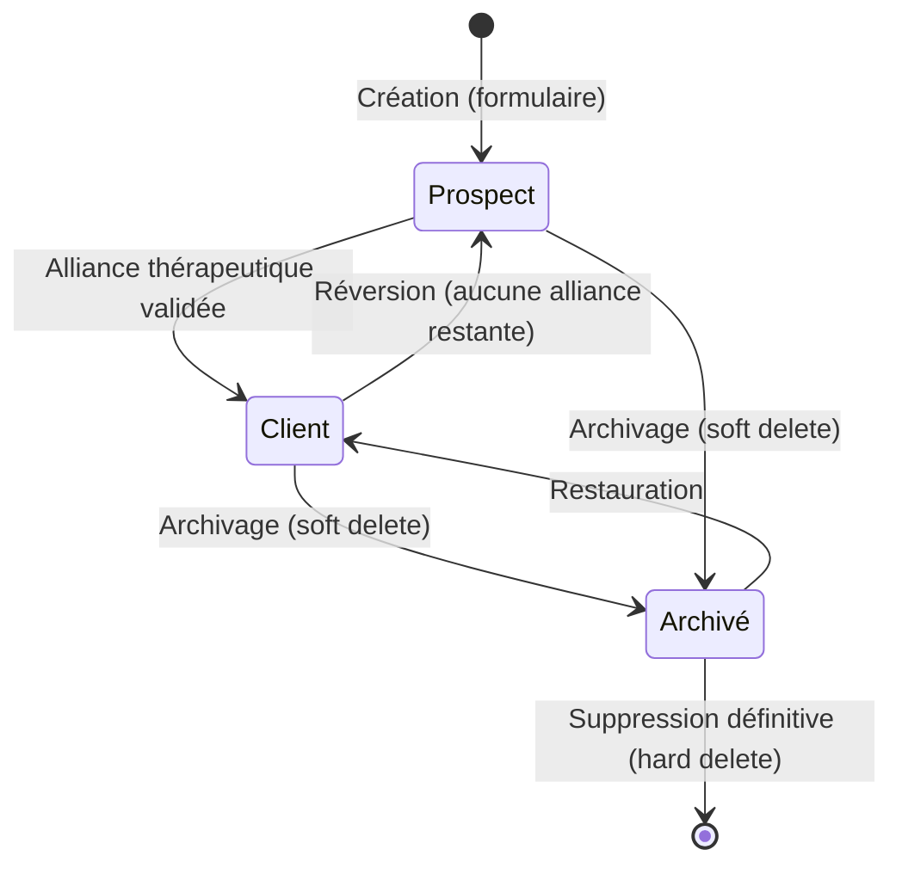
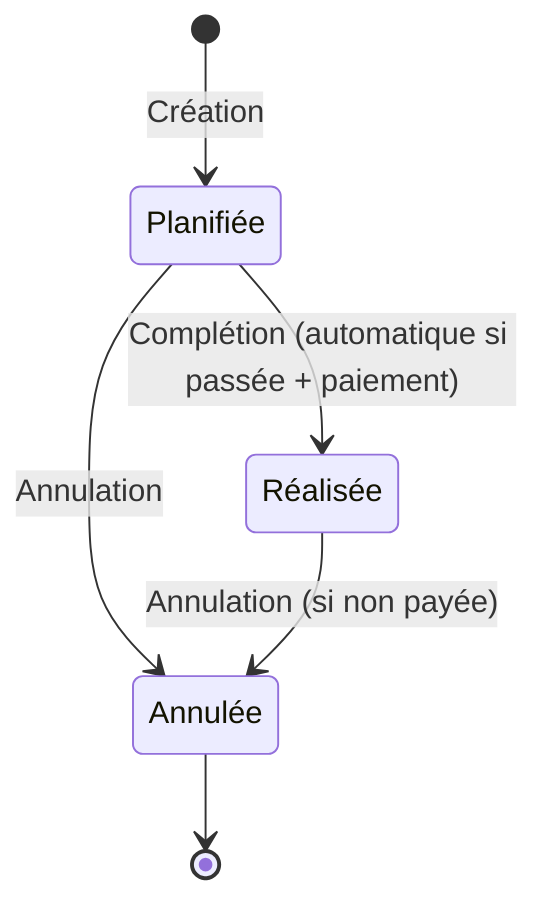
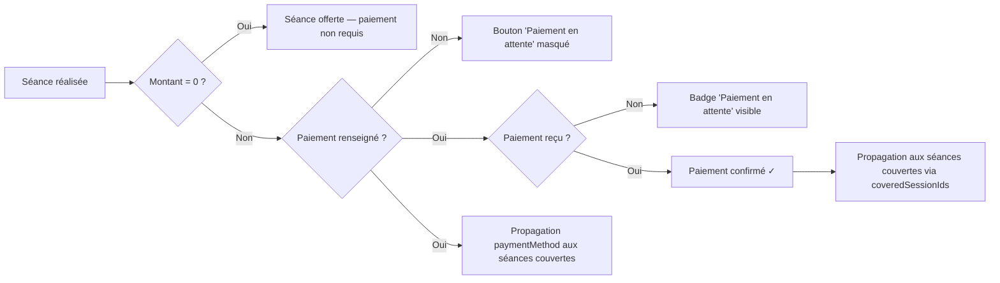
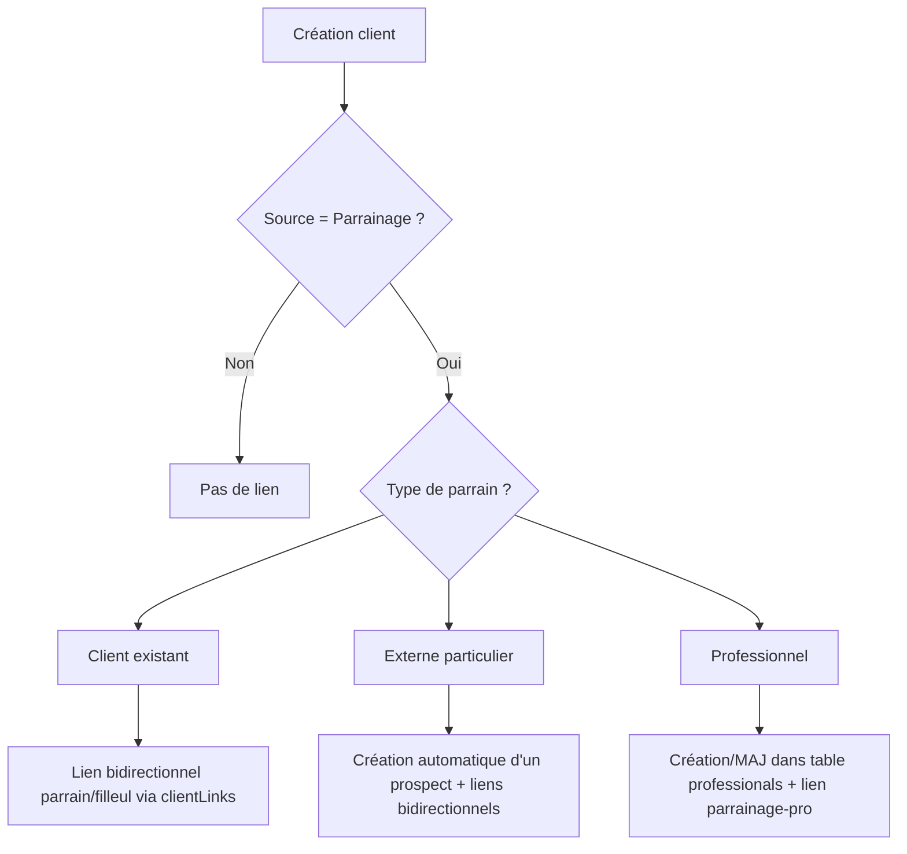
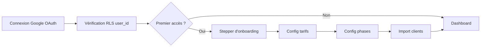

# Règles Métier — CoachCRM

> [!IMPORTANT]
> **Règle d'Or Technique** : Toute modification de code impliquant une logique de calcul ou de transformation doit respecter les principes d'intégrité définis dans [MES_REGLES_TECHNIQUES.md](./MES_REGLES_TECHNIQUES.md).

## Cycle de vie du client

### Création
- Tout nouveau client est créé en tant que **prospect** (`phase: 'prospect'`).
- **Persistance à la création** : Le formulaire de création **doIT** capturer et persister immédiatement les **Notes** du client ainsi que son **Adresse de facturation**. L'absence de ces champs à la création est considérée comme un bug de complétude.

### Transition Prospect → Client
- **Déclencheur** : une séance est complétée (`completed`) ET (un moyen de paiement est renseigné OU le montant est à zéro)
- Le client passe à la première phase thérapeutique (par défaut `debut`)

### Réversion Client → Prospect

#### 1. Par annulation ou report de séance
- **Déclencheur** : une séance est annulée (`cancelled`) ou remise en attente (`scheduled`).
- **Condition** : si après ce changement, le nombre de séances validées (payées ou offertes) tombe à **0**.
- **Effet** : le client redevient automatiquement `prospect`.

#### 2. Par suppression du moyen de paiement
- **Déclencheur** : suppression du `paymentMethod` sur une séance `completed`.
- **Effet** : déclenche le recalcul. Si plus aucune séance n'est validée, retour au statut `prospect`.

#### 3. Par audit automatique (Curatif)
- **Déclencheur** : chargement de l'application (`loadData`).
- **Logique** : l'application vérifie systématiquement la cohérence Phase/Séances. Tout client non-prospect n'ayant aucune séance validée est réinitialisé en `prospect`.

> Alliance thérapeutique = au moins 1 séance `completed` + (`paymentMethod` renseigné OU montant de la séance = **0€**).
> *Note : Le montant d'une séance est déterminé par `payment_amount` (si saisi), sinon par le `session_rate` spécifique du client, sinon par le tarif par défaut du système.*

### Comptage des séances (Logique dynamique)
- **Source de vérité** : Le nombre de séances effectuées n'est plus lu directement depuis la colonne `sessions_count` de la table `clients` (jugée non fiable après des imports massifs). 
- **Calcul UI** : Le compteur (ex: "4/20") est calculé dynamiquement par l'interface en filtrant les séances dont le statut est `completed`.
- **Exclusion historique** : Toute séance datée avant le **01/01/1950** est ignorée dans les calculs et les listes (purgatoire des données "1900" issues d'erreurs d'import Excel).

### Statuts des séances (Suivi Financier)
Le statut affiché est une synthèse dynamique de l'état en base et de la réalité comptable :

- **Planifiée** (Gris) : Séance dont l'heure de fin est dans le futur.
- **À confirmer** (Ambre) : Séance dont l'heure de fin est passée MAIS dont le **moyen de paiement est manquant** (et montant effectif ≠ 0€, incluant `null` si aucun tarif n'est configuré).
- **Réalisée** (Vert) : Séance passée avec **paiement renseigné** (ou montant = 0€) OU séance explicitement marquée `completed` en base.
- **Annulée** (Rouge) : Séance dont le statut est `cancelled`.

**Règle de sobriété visuelle** : 
- Il n'existe plus de statut "Réalisée (Jaune)". Toute séance passée sans paiement est marquée "À confirmer". Dans le détail par séance du suivi financier, le badge affiché est **« CONFIRMER »** précédé de l'icône `HelpCircle` (14px), couleur `#D97706`. Ce badge n'apparaît **pas** pour les séances planifiées (futures).
- Les colonnes **Paiement**, **Encaissé** et **Facture** n'affichent plus d'alerte rouge ou de statut "Non" tant que la séance est en attente de confirmation. À la place, un simple tiret (`AbsenceDash`) est affiché.
- Une fois la séance confirmée (« Réalisée »), la colonne **Encaissé** reprend ses indicateurs habituels (« € » Vert ou « Non » Rouge) pour signaler les impayés.
- **Colonne Montant** : Pour faciliter le suivi des dettes, le montant s'affiche en **rouge** (`var(--error)`) pour toute séance qui n'est pas encore payée. Une fois la séance **encaissée**, le montant s'affiche en **noir** (`var(--text-primary)`). Les séances futures (« Planifiée ») s'affichent en **gris clair** (`var(--text-tertiary)`) pour marquer leur caractère prévisionnel.
- **Séances offertes (0€)** : Les colonnes **Montant**, **Paiement** et **Encaissé** affichent toutes un tiret d'absence (`AbsenceDash`). Aucun encaissement n'est attendu pour une séance offerte — le sablier d'attente ne doit jamais s'afficher.
- **Colonne Facture (Alertes)** : 
    - **"FACTURE ✓"** (Vert) : Si une facture est demandée et déjà envoyée.
    - **"À ÉMETTRE"** (Bleu `var(--primary-500)`) : Si une facture est demandée mais pas encore envoyée. C'est l'alerte visuelle pour le travail administratif restant.
    - **Tiret d'absence** (`AbsenceDash`) : Si aucune facture n'est demandée.
- **Colonne Date** : L'affichage est simplifié au format jour/mois (`25 sept.`). L'année est masquée car elle est déjà indiquée dans le titre de la vue.
- **Colonne Client** : Pour maintenir la compacité du tableau, le nom du client est **tronqué** avec des points de suspension s'il dépasse une certaine largeur (ex: `maxWidth: 300px`). Le nom complet doit rester accessible via une info-bulle (attribut `title`) au survol.
- **Colonne Source** : Confirme le canal d'acquisition du client. Si inconnu, affiche un tiret d'absence (`AbsenceDash`) pour maintenir la propreté du tableau.

### 5. Gestion des Annulations
- **Indemnités d'annulation** : Si une séance est annulée avec maintien du tarif (choix utilisateur), elle est étiquetée **"Annulation facturée"** dans le dashboard financier.
- **Calcul du CA** : Le chiffre d'affaires global et mensuel inclut les séances `completed` ET les séances `cancelled` ayant un montant supérieur à zéro.
- **Alertes Impayés** : Les séances annulées facturées non encaissées déclenchent les mêmes alertes visuelles (montant rouge) et notifications que les séances réalisées.
- **Alliance Thérapeutique** : Une annulation, même payée, **ne valide jamais** l'alliance thérapeutique. Le prospect ne devient Client qu'après une séance `completed` et payée/offerte.
- **Slugs de Phase** : Les phases doivent être enregistrées sans accents (ex: `debut` et non `début`) pour assurer la cohérence avec le code applicatif.
- **Audit de Transition** : En cas d'import de données, un audit doit être réalisé pour passer en phase `debut` tout client ayant au moins une séance terminée (`completed`) et validée financièrement (payée ou offerte à 0€).
- **Objectifs financiers** : Les objectifs mensuels de CA sont persistés par année dans la table `settings` (JSONB `revenue_objectives`). Ils peuvent varier d'une année sur l'autre.

### Diagnostic et Correction (Cas Philippe Peluchon)
Philippe est resté "Prospect" malgré ses séances à cause d'une incohérence de données importées :
1. Les séances étaient marquées `début` (avec accent) alors que le code attend `debut`.
2. La phase par défaut à l'import était `prospect`.
3. Solution : Harmonisation SQL des phases et mise à jour de la logique d'import pour utiliser `debut`.
- **Progression** : Une séance annulée ne consomme pas de numéro de séance (ex: si la S4 est annulée, la séance suivante reste la S4).
- **Libellé Facture** : Toute annulation facturée porte la mention **"Annulation facturée"** (automatiquement renseignée dans le champ raison d'annulation).

## Création de séance (modale Accueil)
- **Normalisation des Prénoms** : Chaque prénom (dans `partner_a` et `partner_b`) doit impérativement commencer par une majuscule pour chaque mot (ex: `Jean-Christophe`, `Anne-Marie`). Cette règle est appliquée automatiquement à la création et à la modification.

### Champs obligatoires
- **Client** : sélection obligatoire parmi les clients actifs (prospects inclus)

### Valeurs par défaut
- **Type d'accompagnement** : L'utilisateur doit choisir entre **Individuel**, **Couple** (remplace "Client" pour plus de clarté) ou **Famille**.
- **Date** : par défaut = date du jour
- **Heure** : par défaut = heure entière (XX:00) qui précède l'instant actuel
- **Note de préparation** : optionnel
- **Durée** : par défaut 60 minutes (modifiable dans le détail de la séance)

### Comportement UI (Création)
- Le titre de la modale s'adapte au type choisi : « Nouveau client », « Nouveau Couple » ou « Nouvelle Famille ».
- L'étape Identité affiche également un titre contextuel (ex: « Le Couple »).
- Pas de ligne horizontale entre les sections de la modale
- Si aucun client ne correspond à la recherche : afficher « Aucun client trouvé »
- Si une séance existe déjà pour le même client + même jour : alerte doublon
- Si d'autres séances existent le même jour (autre client) : alerte informative

### Limites de date
- **Date minimale** : 1er janvier 2000 — le système empêche la création ou la modification d'une séance (ou d'une date de création de dossier client) antérieure à cette date.
- **Date maximale** : moment présent + 3 ans — le système empêche la création ou la modification d'une séance (ou d'une date de création de dossier client) au-delà de cette limite.
- Ces contraintes s'appliquent via les attributs `min`/`max` sur les inputs de date (création dans `DashboardPage`, édition dans `SessionDetailModal`, et date de création du dossier dans `ClientCreationMarker` au sein de `ClientDetailPage`), et le bouton de création est désactivé si la date est hors bornes.
- **Navigation financière** : Les mêmes bornes (2000 – maintenant + 3 ans) s'appliquent à la navigation temporelle du module Finances (vue consolidée annuelle et vue détaillée mensuelle). Les boutons de navigation sont désactivés visuellement aux limites.
- **Date de création du dossier client** : L'input date de modification de la `startDate` dans la timeline thérapie applique les mêmes contraintes `min`/`max`. Toute date saisie hors bornes est rejetée automatiquement.

### Barre d'action flottante (pour sélection multiple)
- **Contextes** : Utilisé pour les suppressions groupées (Archivage, Suppression Réseau Pro).
- **Format** : Bandeau collant en bas de tableau, fond blanc, texte d'état à gauche, bouton(s) d'action à droite.

## Composants Dashboard (Pilotage)

### Section "Action requise" (Dashboard)
- **Position** : Sous le bloc de statistiques globales, dans la colonne de droite (34%).
- **Contenu** : Fusion des urgences techniques (CR, Paiements, Factures) et des relances clients.
- **Visuel** : Cartes verticales compactes avec icônes de couleur, transition au survol pour inciter à l'action.
- **Carte d'identité client** : Chaque item du panneau latéral (`ActionDetailPanel`) affiche une pastille ronde d'équipe d'identité via `ClientTypeBadge` (type + initiales + bordure colorée). Les prospects sont affichés en violet override.

#### Icônes des cartes urgentes (référence charte)

| Action | Icône | Couleur | Fond | Source |
|--------|-------|---------|------|--------|
| **CR à rédiger** | `ReportIcon` (composant) | `#2B6CB0` | transparent | Charte — Compte-rendu |
| **Séances à confirmer** | `HelpCircle` (Lucide) | `#D97706` | transparent | Charte — sémantique « à confirmer » |
| **Factures à émettre** | SVG custom document+€ | `var(--primary-500)` | transparent | Charte — signalétique facture |
| **Prospects à relancer** | `Sprout` (Lucide) | `#7C3AED` | transparent | Charte — Phase début / prospect |

> [!NOTE]
> **Fond des cartes urgentes** : toutes les cartes « Actions requises » ont un fond **transparent** avec uniquement une bordure subtile `${color}30`.

> [!NOTE]
> **Badge « Rédiger CR »** (SessionCard) : affiche uniquement le texte, **sans icône**. Style : fond `#FFF3E0`, couleur `#E67E22`, bordure `#E67E2240`.

> [!IMPORTANT]
> **Icône facture** : Il est **interdit** d'utiliser une icône Lucide standard (`FileText`, `Receipt`) pour la signalétique de facturation. Seule l'icône SVG custom (document + symbole €) documentée dans `MA_CHARTE_GRAPHIQUE.md` est autorisée.

### Recherche Rapide (Dashboard)

#### Comportement cross-tabs
- Dès qu'un filtre est actif (nom, date, facture, paiement), la recherche porte sur **toutes les séances** (en cours + historique).
- Les onglets « En cours / Historique récent » sont masqués et remplacés par le label `🔍 RECHERCHE — N séance(s)` + bouton [Effacer].
- Le bouton × sur l'input date permet d'effacer uniquement la date.

#### Filtre par date — règles d'affichage

| Cas | Affichage |
|-----|-----------|
| **Séances trouvées le jour choisi** | Afficher les séances du jour + les séances des jours suivants, **10 maximum** |
| **Aucune séance le jour choisi** | Message « Pas de séances le [date formatée] » + les **5 prochaines séances** après cette date |

Dans les deux cas :
- Tri **chronologique** (date croissante)
- Bouton **« Charger plus de RDV »** visible si d'autres séances existent au-delà du lot affiché
- Combinable avec le filtre par nom (AND logique)

#### Feedback visuel des champs de recherche
- Quand un champ est rempli (nom ou date) : **bordure ambre** `1.5px solid #D97706` + **bouton ×** pour effacer
- L'icône loupe du champ nom passe aussi en ambre `#D97706` quand du texte est saisi
- Le bandeau de résultats (en haut) affiche le compteur + bouton **[✕ Effacer]**

### Bloc Statistiques Globales (Dashboard)
- **Position** : En haut de la colonne de droite, au-dessus des actions requises.
- **Structure** : Grille compacte 3×2 de 6 KPIs.
- **Ordre (gauche→droite, haut→bas)** : Clients actifs, Prospects, **Parrains**, CA du mois, Conversion, **Séances ce mois**.
- **Chaque KPI** : Icône thématique + valeur numérique dans une cellule compacte.

### Affichage « Aujourd'hui » dans l'agenda
- Le header de date affiche **« Aujourd'hui – [date complète] »** (ex: « Aujourd'hui – 31 mars 2026 »).
- Style distinctif : couleur **`var(--accent-main)`** (doré), **point coloré** (6px) devant le mot, **bordure 2px** au lieu de 1px.
- Les autres dates restent en `var(--primary-400)` avec bordure standard.
- **Affichage de l'année** : Si une séance est éloignée de **plus de 6 mois** du moment présent (passée ou future), l'année est affichée dans le header de date (ex : `Jeudi 28 septembre 2025`). En dessous de 6 mois, l'année est masquée.

### Grid de Pilotage
- **Structure** : Layout flexible `65fr 35fr` (Desktop).
- **Gauche (65%)** : Focus sur l'immédiat (Agenda, Préparation de séance).
    - **Règle de largeur** : L'agenda occupe une largeur fixe de **65%** de l'espace principal.
- **Droite (35%)** : Focus sur la gestion proactive (Urgences, Relances, Stats).

### Affichage de l'Agenda (Timeline)
- **Troncature des noms** : Si le nom et le prénom du client sont trop longs pour tenir sur une ligne, ils sont coupés avec des points de suspension (**"..."**).
- **Séparateur** : Aucune ligne de séparation horizontale n'est présente sous le titre de l'agenda pour épurer le design.
- **Tri des séances** :
    - **Onglet « En cours »** : Tri chronologique **ascendant** (séances les plus proches d'abord).
    - **Onglet « Historique récent »** : Tri chronologique **descendant** (séances les plus récentes d'abord, les plus proches d'aujourd'hui en haut).

### Navigation "Retour" intelligente
- **Règle** : Le bouton de retour sur une fiche client doit préserver le flux de travail de l'utilisateur.
- **Comportement** :
    - Si l'utilisateur accède à la fiche via le **tableau de bord** (clic sur un agenda ou une relance) : le bouton "Retour" renvoie à l'accueil (`/`).
    - Si l'utilisateur y accède via la **liste des clients** : le bouton "Retour" renvoie à `/clients` (avec maintien de l'onglet actif Prospect/Client).
    - **Navigation Contextuelle Finances → Client** : En cliquant sur un client depuis le module `Finances`, le système doit ouvrir la fiche client ET scroller/étendre automatiquement la séance concernée par la ligne de tableau cliquée. Un délai de **300ms** est appliqué à l'ouverture de la séance pour laisser le temps à l'animation de la fiche client de se terminer proprement.
    - Si l'accès est direct (URL) : fallback sur la liste des clients.

### Montant par défaut
- Le montant d'une nouvelle séance est déterminé par la hiérarchie suivante (priorité décroissante) :
    1. **Tarif du cycle actif** (`therapy_cycles.rate`)
    2. **Tarif spécifique du client** (`client.session_rate`)
    3. **Tarif global du cabinet** (`sessionRates.individual` ou `sessionRates.client` selon le type de client)
- Ce montant est automatiquement pré-rempli dans le panneau `SessionDetailModal` lors de la création.

### Phase héritée
- La nouvelle séance hérite de la **phase de la dernière séance** du client (si elle existe)
- Sinon, hérite de la **phase du client** (sauf si prospect)
- **Première séance d'un prospect** → phase = première phase thérapeutique configurée (par défaut : `début`)

## Complétion et Confirmation de séance

### 1. Séance "Terminée" (Completed)
- **Définition** : Une séance est considérée comme terminée uniquement lorsque son heure de fin est atteinte.
- **Calcul** : `Moment de fin = Date de début + Durée (en minutes)`.
- **Règle** : `maintenant >= moment de fin`.

### 2. Séance "Confirmée" (Confirmed)
- **Condition de confirmation** : Une séance est confirmée si et seulement si :
    1. Elle est **Terminée** (au sens défini ci-dessus).
    2. **ET** l'utilisateur a renseigné un **mode de paiement** (`paymentMethod` ≠ null) **OU** a déclaré un **honoraire à 0€** (séance offerte).

### 3. Signalétique "À Confirmer"
- **Cible** : Séances terminées mais non confirmées.
- **Éléments visuels** : Badge « CONFIRMER », message d'alerte orange, et bouton « Rédiger CR » (comme défini dans la Section 12).

### 4. Déclenchement de la transition
- **Automatique** : Au chargement de l'application ou lors d'un rafraîchissement des données (audit de cohérence).
- **Manuel** : Dès que l'utilisateur renseigne le paiement sur une séance dont le moment de fin est passé.

### 5. Préfixe de durée (Séances planifiées)
- **Règle** : Toutes les séances programmées (`scheduled`) affichent leur durée avant la note de préparation.
- **Format** : `[DURÉE] MIN : [Texte de la note]`.
- **Typographie** : Affichage discret mais lisible pour distinguer la durée du corps de la note.

> ⚠️ **Règle absolue** : Une séance future (dont le moment de fin n'est pas encore atteint) ne peut être ni "Terminée" ni "Confirmée", même si le paiement est anticipé. Elle reste en attente de réalisation.

## Cycle de vie d'une Séance

## Signalétique des séances passées non confirmées

### Définition
Une séance est considérée « passée » dès que `maintenant >= moment de fin` (Heure de début + Durée).

### Conditions d'activation
- La séance est passée.
- Le mode de paiement n'est **pas** renseigné (`paymentMethod` = null) **ET** le montant effectif est **≠ 0** (inclut `null` = tarif non configuré).
- Le statut n'est **pas** `cancelled`.

### Éléments visuels obligatoires (les 3 ensemble)
1. **Badge « CONFIRMER »** — affiché dans la ligne d'info, couleur ambre `#D97706`
2. **Message d'alerte** — texte : *« Séance à confirmer — Veuillez renseigner le mode de paiement. »*, même couleur
3. **Bouton « Rédiger CR »** — affiché à droite de la carte, fond `#FFF3E0`, couleur `#E67E22`
4. **Icône ⚠️** — triangle d'avertissement en coin droit (pour les séances `scheduled` passées sans CR)

### Troncature des aperçus (CR et Notes)
- **Agenda Dashboard** : Limite brute à **50 caractères**.
- **Timeline Thérapie (Fiche Client)** : Limite plus restrictive à **35 caractères** pour préserver la lisibilité de la timeline.

> ⚠️ **Règle absolue** : ces éléments doivent **toujours** apparaître ensemble pour toute séance passée non confirmée. Il ne doit jamais y avoir de séance passée avec l'icône ⚠️ seule sans le badge et le message.

### Synchronisation inter-pages
Cette signalétique est **identique** sur toutes les vues grâce au composant partagé `src/components/session/SessionCard.jsx` :
- **Page d'accueil** (calendrier des séances) — `showClientName={true}`
- **Page client** (timeline thérapie) — `showClientName={false}, showExpandedStyle={true}`
- **Modale détail séance**
- **Modale détail séance**

> [!IMPORTANT]
> **Règle de synchronisation du `ConfirmBadge`** :
> Le badge "CONFIRMER" doit s'afficher pour toute séance passée sans `paymentMethod`, **y compris** les séances dont le statut en base est `completed` (auto-confirmées lors d'un chargement précédent). La condition dans `SessionCard.jsx` est :
> `needsConfirm = isPast && !isCancelled && !isOffered && (!isConfirmed || !session.paymentMethod)`
> Cela garantit la cohérence entre le timeline, le dashboard et le suivi financier.

- **Suivi financier** (détail par séance) : Le `ConfirmBadge` seul gère le statut visuel — aucun texte "À confirmer" supplémentaire ne doit être affiché (anti-redondance).

> ⚠️ **Règle de persistance** : Le passage automatique du statut `scheduled` → `completed` en base de données ne se fait **que** si un mode de paiement est renseigné (ou si le montant est de 0€). Sans paiement, la séance reste "planifiée" techniquement mais affichée comme "à confirmer" pour inciter à l'action. **Cette règle ne s'applique jamais aux séances de statut `cancelled`.**

> ⚠️ **Règle métier — Notes et Comptes rendus** :
> - Le champ `summary` (Résumé) est utilisé de manière polyvalente : **Note de préparation** pour les séances futures, **Compte rendu** pour les séances passées.
> - L'icône de document (`FileText`) ne s'affiche **que** pour les séances passées ayant un contenu. Elle est masquée pour les séances futures.

> ⚠️ **Règle absolue** : toute modification visuelle de carte de séance doit se faire exclusivement dans `SessionCard.jsx`. Il est strictement interdit de dupliquer le JSX de rendu dans les pages.

Toute modification de la signalétique doit être répercutée sur **toutes** ces vues simultanément.

## Annulation de séance
- **Interdit** si un moyen de paiement est renseigné ET montant > 0 → alerte utilisateur
- Avant d'annuler, l'utilisateur doit d'abord supprimer le moyen de paiement
- **Exception** : les séances offertes (montant = 0) peuvent toujours être annulées

### Suppression définitive de séance annulée
- L'icône **XCircle** sur les séances annulées est un **bouton cliquable** qui supprime définitivement la séance
- **Confirmation obligatoire** via le ConfirmDialog (variant `destructive`)
- La séance disparaît du **timeline** et du **calendrier** après suppression
- Fonctionne sur les **2 vues** : timeline client (CoupleDetailPage) et calendrier d'accueil (DashboardPage)
- Implémenté via `onDelete` dans `SessionCard.jsx` avec `stopPropagation` (ne déclenche pas l'ouverture du détail)

## Suppression groupée de séances (accueil)
- Disponible uniquement sur l'onglet **« En cours »** du calendrier d'accueil
- L'utilisateur active le **mode sélection** via le bouton « Sélectionner »
- En mode sélection : clic sur une carte = sélection/désélection (pas de navigation)
- Une **barre d'action flottante** affiche le nombre de séances sélectionnées
- Boutons : « Tout sélectionner / Tout désélectionner » + « Supprimer (N) »
- La suppression déclenche une **confirmation obligatoire** via le ConfirmDialog
- **Cascade** : les reports liés aux séances supprimées sont également supprimés
- **Vérification d'alliance** : après suppression, pour chaque client affecté, le système vérifie si des séances restantes valident l'alliance thérapeutique. Si aucune séance ne la valide, le client redevient automatiquement **prospect**
- Après suppression, le mode sélection se désactive automatiquement

## Relance prospects (Dashboard)
- **Cible** : Uniquement les dossiers en phase `prospect`.
- **Règle d'affichage** : Un prospect est affiché dans le bloc « Relance prospects » si :
    1. Il n'a **aucune séance future** planifiée.
    2. Il n'a **aucune séance passée non confirmée** (les séances passées doivent être traitées/confirmées avant que la relance ne soit pertinente).
    3. Il n'a jamais eu de séance (Nouveau prospect).
- **Délai de relance** : 14 jours d'inactivité après la dernière séance ou la création du dossier.
- **Affichage du contact** : En dessous du nom, affiche le dernier contact effectué (icône Appel/SMS/Email) suivi de la date relative.
- **Navigation** : Le bouton « Voir tous les prospects » redirige vers `/clients?tab=prospects&view=list`.

## Flux de Paiement & Facturation

### Règle du Badge « FACTURE »
- **Condition** : Le badge s'affiche sur la carte séance si `needsInvoice` est à vrai (SessionCard).
- **États visuels** :
    - **À émettre** : Libellé « FACTURE », couleur bleu `var(--primary-500)`, tooltip « Facture à envoyer ».
    - **Facturée** : Libellé « Facturée », couleur vert `var(--success)`, tooltip « Facture envoyée ».
- **Calcul** : Basé sur le champ `invoice_sent` de la séance.

## Bouton « Paiement en attente »
- **N'apparaît pas** tant que le mode de paiement n'a pas été choisi ET que le montant du paiement est > 0
- Conditions requises : `paymentMethod` renseigné + `paymentAmount > 0`

## Séance offerte (montant = 0)

### Affichage dans la carte séance
- Le badge en en-tête affiche **« Séance offerte »** en rouge
- L'alerte **« Séance à confirmer »** est **toujours masquée** (pas de paiement à confirmer pour cette séance)
- Le badge **« CONFIRMER »** est **toujours masqué**

### Mode de paiement (section comptable)
- **Si aucune autre séance payante n'est couverte** par ce paiement :
  - Les boutons (Espèces, Chèque, Virement) sont **remplacés** par le badge rouge « Séance offerte »
- **Si d'autres séances payantes sont couvertes** (`coveredSessionIds` contient des séances avec montant > 0) :
  - Les boutons de paiement restent **visibles** pour permettre la confirmation du paiement des séances couvertes
  - Le badge « Séance offerte » s'affiche en complément au-dessus des boutons
- **Champs masqués** : « Montant du paiement » et « Séances concernées par ce paiement » sont **cachés**

### Suivi financier
- « Séance offerte » remplace le mode de paiement
- **Section pilotage supprimée** : Les 3 cartes « Paiements en attente », « Séances à confirmer » et « Factures à émettre » ont été retirées de la page Finances. Ces indicateurs restent visibles uniquement via le Dashboard (Actions requises).
- **Export** : Le bouton d'export s'intitule **« Export suivi financier »** (anciennement « Export CSV »).
- **Graphiques** :
  - **Canaux d'acquisition** (anciennement « Performance par canal ») — barres grises uniformes `#A0AEC0`, icône grise.
  - **Types de clients** (anciennement « Répartition par type ») — barres grises uniformes `#A0AEC0`, icône grise.
- **Normalisation des sources** : `countClientsBySource` normalise les clés de source en construisant un pont ancien-clé→nouveau-clé via les labels des constantes par défaut. Une source `'website'` (ancienne clé) et `'Site web'` (label français) sont fusionnées sous la même entrée. Les sources sans correspondance sont affichées telles quelles ; `unknown` → « Non renseigné ».

### Alliance thérapeutique (Statut Prospect ↔ Client)

L'alliance thérapeutique est validée par la présence d'au moins une séance « payée » ou « offerte ».

- **Condition de validation** : Une séance est considérée comme validant l'alliance si elle est au statut `completed` (terminée) **OU** si elle est dans le passé (`date ≤ maintenant`) avec un moyen de paiement renseigné (ou si le montant = 0€).
- **Transition Prospect → Client** : Automatique dès que la **première séance** validant l'alliance est créée ou confirmée (le paiement valant engagement). Le client passe de la phase `prospect` à la première phase thérapeutique (ex: `début`).
- **Transition Client → Prospect** : Automatique si **toutes les séances** validant l'alliance sont supprimées ou annulées. Le client redevient un prospect.
- **Événements déclencheurs** : 
  - Création d'une séance passée avec paiement.
  - Mise à jour d'une séance (passage à `completed`, ajout d'un paiement).
  - Suppression d'une séance (individuelle ou groupée).
  - Annulation d'une séance.

> ⚠️ **Note technique — Calcul du montant effectif** :
> Le montant d'une séance est déterminé par `getRate()` dans `useSessionModalState.js`, avec la priorité suivante :
> 1. `rateOverrides[sessionId]` — modification en cours (volatile, mémoire uniquement)
> 2. `session.paymentAmount` — montant persisté en DB (même si = 0 pour séance offerte)
> 3. `originalRate` / `sessionRate` — tarif par défaut du client (fallback)
>
> **Règle absolue** : ne jamais utiliser `session.paymentAmount ?? rate` directement. Toujours passer par `getRate()` (modale) ou `getDefaultRate()` (finances) pour garantir la cohérence entre le montant affiché et les tarifs réels (client ou système).

> [!IMPORTANT]
> **Règle métier — Changement du tarif spécifique** :
> Le changement du tarif spécifique d'un client affecte **uniquement les séances planifiées** (status `scheduled`). Les séances déjà réalisées (completed) ou annulées gardent leur tarif, peu importe la manière dont il a été défini.
>
> **Implémentation** : Lors du changement de tarif dans `ClientStatsPanel.jsx`, toutes les séances non-planifiées qui n'ont pas encore de `paymentAmount` persisté se voient attribuer l'ancien tarif via `updateSession()` **avant** la mise à jour du tarif client. Ainsi, `getRate()` retournera toujours le montant persisté pour ces séances et ne retombera jamais sur le nouveau tarif par défaut.

> ⚠️ **Comportement confirmé — Paiements multi-séances** :
> - **Propagation** : Quand des séances sont cochées dans « Séances concernées par ce paiement », elles reçoivent le `paymentMethod` de la séance principale. Le `paymentAmount` de chaque séance **ne change pas** — chaque séance garde son propre tarif.
> - **Exclusion des séances encaissées** : Une séance déjà encaissée (`paymentReceived = true`) n'apparaît pas dans la liste des « Séances concernées par ce paiement » d'un autre paiement (sauf si elle fait déjà partie du groupe couvert).
> - **Affichage bidirectionnel** : Ouvrir une séance couverte (S1) affiche le groupe complet (S1, S2, S3) dans « Séances concernées ». Le lookup s'effectue via `effectiveOwner` (parent qui porte les `coveredSessionIds`).
> - **« Séances à confirmer »** : Exclut les séances couvertes par un paiement groupé (via `coveredSessionIds` d'une autre séance avec `paymentMethod` renseigné). Inclut les séances offertes.
> - **« Restant dû »** : `totalBilled - totalCollected`. Inclut toutes les séances passées (confirmées ou non) moins celles encaissées. Les séances passées non confirmées sont dans « Honoraires dûs » et contribuent au restant dû.
> - **Persistance** : `coveredSessionIds` sur la séance propriétaire, `paymentMethod`/`paymentReceived` sur les séances couvertes — tout est persisté en DB.
> - **Couleur du tarif** dans le détail financier : **vert** (`var(--success)`) uniquement si `paymentReceived = true` ET `paymentMethod` renseigné. **Rouge** (`var(--error)`) dans tous les autres cas. Gris (`var(--text-tertiary)`) pour les séances planifiées futures.
> - **Calcul des Honoraires dûs / planifiés** : Une séance planifiée (`scheduled`) est comptée dans « Honoraires dûs » uniquement si son **heure de fin** (`date + duration`) est passée. Avant la fin de la séance, elle reste dans « Honoraires planifiés ». Ce calcul est cohérent avec le badge visuel « Planifiée » / « À confirmer ».
> - **Règle d'encaissement** : Une séance est comptée comme « encaissée » (`totalCollected`, KPI « Encaissé ») uniquement si `paymentReceived = true` **ET** `paymentMethod` est renseigné. Les deux conditions sont requises dans `ClientFinancialPanel`, `FinancesPage` et le Dashboard.
## Indicateur de Transformation (Finances)

### 1. Définition de la Transformation
- Un dossier est considéré comme « transformé » (converti) le mois de sa **première séance validée** (completed + payée ou à 0€).
- Cette règle s'applique indépendamment de la date de création du dossier.

### 2. Tri Chronologique (Règle d'Or)
- **Ascendant obligatoire** : Toutes les listes financières (tableaux détaillés, liste des transformations) doivent être triées par ordre chronologique **croissant** (du 1er au 31 du mois).
- Le premier jour du mois doit apparaître en haut de la liste.

### 3. Visualisation "Transformation Prospects"
- **Style épuré** : Affichage d'une liste simple des clients transformés dans le mois sélectionné.
- **Interdiction** : Ne pas afficher d'indice de conversion (%), de ligne de séparation, de sous-titre "dernière transformation" ou d'icônes de progression.
- **Icône de section** : Utilisation exclusive de l'icône `Zap` (`#D69E2E`) pour marquer l'énergie de la transformation.
- **Format** : `1. Nom du Client (Date)`.

## Dédoublonnage
- Alerte si même client + même jour (bloquante avec confirmation)
- Alerte si autres clients le même jour (informationnelle, désactivée pour les prospects)

## Date de création du dossier
- **Modifiable** : clic sur la date dans la timeline de la thérapie → input date inline
- **Alerte visuelle** : un bandeau ambre discret (`#FFFBEB`, bordure `#FEF3C7`, icône `AlertTriangle` `#D97706`) s'affiche sous le champ :  
  *« Cette date impacte l'historique et les cycles de thérapie »*
- **Confirmation obligatoire** : ConfirmDialog variant `danger` avant persistance
- **Persistance** : `updateClient(id, { startDate })` → colonne `start_date` en DB

## Cycles de thérapie
- Un dossier client peut comporter plusieurs **cycles de thérapie** (ex: reprise après une longue pause).
- **Structure** : Chaque cycle possède une date de début, un tarif spécifique (à la création), un objectif de nombre de séances et une phase initiale.
- **Nouvelle thérapie** : Le bouton « Nouvelle thérapie » archive le cycle actuel et en crée un nouveau. Les séances passées restent liées à leur cycle d'origine via la date de début.
- **Persistance** : Table `therapy_cycles`.

## Comptes rendus (CR en attente)
- L'indicateur « CR en attente » sur la fiche client compte les **séances complétées sans compte rendu** dans le cycle actif
- Formule : `activeCycleSessions.filter(s => s.status === 'completed' && !s.hasReport)`
- Couleur : `var(--warning)` si > 0, `var(--info)` sinon
- L'ancien compteur « CR » (nombre de CR remplis) est toujours disponible via `reportsCount` pour la synthèse IA

## Archivage et suppression
- **Archivage** (soft delete) : le client est masqué mais restaurable
- **Suppression définitive** (hard delete) : supprime le client + séances + CR + contacts (irréversible)
- Sélection multiple possible (checkboxes) dans les deux pages

## Champs numériques
- **Zéros en début de saisie** : interdit (ex: `007` → `7`, `00` → `0`)
- La valeur `0` reste autorisée (ex: séance offerte)
- Appliqué globalement via un listener sur tous les `input[type="number"]`

## Parrainage

### 3 niveaux de référencement
1. **Client → Client** (type `parrainage`, roles `parrain`/`filleul`) — liens bidirectionnels via `clientLinks[]`
2. **Externe particulier → Client** — crée un prospect automatiquement + liens bidirectionnels
3. **Professionnel externe → Client** (type `parrainage-pro`) — lien avec le réseau pro

### Validation à la création d'un client
- Si source = `parrainage` ou `referral`, le champ **« Orienté par »** est **obligatoire** (client existant OU externe avec nom renseigné)
- Le bouton « Créer le client » est **désactivé** tant que cette condition n'est pas remplie
- Le composant partagé **`ReferrerSection.jsx`** est utilisé à la création (CouplesPage) et à l'édition (EditIdentityModal) pour garantir un comportement identique

### Anti-doublons et intégrité
- **Détection de doublons parrains particuliers** : comparaison nom/prénom/email/phone avec les clients existants → alerte `DuplicateAlert` avec option « Lier »
- **Détection de doublons parrains professionnels** : comparaison nom/prénom avec la table `professionals` → alerte `DuplicateAlert` avec option « Lier »
- La détection s'applique partout : création ET édition (via `ReferrerSection`)
- Anti auto-parrainage : un client ne peut pas se parrainer lui-même
- Détection de boucle : A parrain de B ET B parrain de A → interdit
- Doublon de lien : un même lien ne peut pas être créé deux fois

### Nettoyage automatique
- Changement de source (≠ parrainage) → supprime tous les liens de parrainage + `externalReferrer`
- Suppression d'un lien filleul → suppression du lien inverse chez le parrain

### 3. Persistance complète des données dossier
Les éléments suivants sont systématiquement persistés en base de données (Supabase) pour garantir l'absence de perte de données :
- **Notes structurées** : Dynamique relationnelle, Axes de travail, Points de vigilance, Objectifs (colonnes dédiées).
- **Notes libres** : Champ `notes` du client.
- **Fréquence des séances** : Colonne `session_frequency`.
- **Synthèse IA** : Colonne `ai_synthesis` (JSONB).
- **Objectif de séances** : Colonne `total_sessions` (pour le cycle actif ou le client).
- **Tarif client** : Colonne `session_rate`.
- **Adresse de facturation** : Colonne racine `billing_address` (type `text`).
- `clientLinks` persisté en DB via colonne `client_links` (JSONB)
- `externalReferrer` persisté en DB via colonne `external_referrer` (JSONB)

## Sécurisation et Persistance des Données

### 1. Robustesse des appels asynchrones
- **Règle d'or** : Tout appel à une fonction de modification (`updateClient`, `updateSession`, etc.) **DOIT** être précédé de `await` dans les composants UI.
- **Feedback visuel** : Un indicateur de chargement (ex: `isSaving`) doit être utilisé pour désactiver les boutons d'action et informer l'utilisateur durant le temps de réponse de Supabase.
- **Gestion des erreurs** : En cas d'échec de la requête, la modale d'édition doit **rester ouverte** pour ne pas faire perdre sa saisie à l'utilisateur.

### 2. Intégrité de l'état React
- **Interdiction de mutation directe** : Il est strictement interdit de modifier directement les propriétés d'un objet client (ex: `couple.partnerA = ...`) présent dans l'état global.
- **Flux de mise à jour** : Les modifications doivent être envoyées à la base de données, et c'est le rafraîchissement global (`loadData`) qui doit mettre à jour l'interface avec les données de vérité provenant de Supabase.

## Avatars
- **Client inactif** : initiales en **blanc** sur fond `primary-200`
- **Prospect** : initiales en `#6B46C1` sur fond `#E8D8FE`
- **Client actif** : initiales en blanc sur fond `accent-main`
- **Initiales** : calculées via `getClientInitials` avec fallback sur `?`

## Sécurisation et Stabilité

- **Normalisation des Données (Prénoms)** : Il est **obligatoire** de normaliser les prénoms (FirstNames) via la fonction `capitalizeWords` dans les adaptateurs. Chaque mot (séparé par un espace ou un tiret) doit commencer par une majuscule. Cela garantit une UI propre et professionnelle quelles que soient les saisies utilisateur.
    - *Exemple* : `"jean-baptiste"` → `"Jean-Baptiste"`.
- **Clean Architecture (No Mocks)** : Toute donnée métier ou constante doit provenir des fichiers `src/data/constants.js` ou `src/data/helpers.js`. Le fichier `mockData.js` est proscrit en production pour éviter toute confusion avec des données de test.

### 2. Robustesse de l'affichage (Anti-Crash)
- **Gestion des dates** : Toute manipulation de date pour affichage **DOIT** utiliser les helpers sécurisés de `src/data/helpers.js` (`formatDate`, `formatTime`). L'utilisation directe de `new Date(str).toLocaleDateString()` est proscrite car elle provoque un crash fatal si `str` est invalide ou `undefined`.
- **Gardes de rendu** : Les composants de page (ex: `AdminPage`) doivent implémenter un bloc `try-catch` dans leurs effets de chargement et un état d'erreur visuel explicite pour éviter l'écran blanc.
- **Sécurité des colonnes** : Lors d'un `select('*')` sur Supabase, s'assurer que l'accès aux propriétés de l'objet résultant est protégé par un `optional chaining` ou des valeurs par défaut (ex: `user.name || 'Sans nom'`).

### 2. Authentification
- **Timeout de sécurité** : Un délai de **10 secondes** est configuré dans `App.jsx` pour permettre la synchronisation complète des données utilisateur (Goole Auth → Table `users`) avant de basculer sur l'interface principale.
- **Chargement initial** : Un spinner de chargement est maintenu tant que l'utilisateur n'est pas synchronisé.
### Réseau Professionnel
- **Gestion des fiches** : Un professionnel peut être contacté, modifié ou supprimé.
- **Sélection Multiple** : Permet la suppression en masse des contacts sélectionnés via un bandeau d'action rouge.

### Pilotage Intelligent (Tableau de Bord)
- **Consolidation** : Toutes les actions prioritaires sont regroupées dans le bloc "Action requise" à droite.
- **Règle de Relance Prospects** : Un prospect est marqué « À relancer » si les conditions suivantes sont réunies :
    1. **Statut** : Le dossier est `active` et sa phase est `prospect`.
    2. **Engagement** : Aucune séance future n'est planifiée (`upcomingSessions`).
    3. **Délai** : La dernière séance réalisée remonte à **plus de 14 jours**.
    4. **Nouveau dossier** : Un nouveau prospect sans aucune séance est également marqué à relancer après 14 jours d'inactivité.
- **Urgences Administratives** : Les séances terminées sans compte-rendu, les paiements en attente de confirmation (> 0€) et les factures non envoyées sont signalés comme actions prioritaires.
### Gestion des partenaires
- **Ajout** : Les nouveaux partenaires peuvent être créés via la modale de création ou automatiquement lors d'un parrainage professionnel (si inconnu).
- **Suppression** : 
    - **Individuelle** : Possible via l'icône corbeille (non destructive si liée à des parrainages, mais retire le partenaire de la liste active).
    - **Groupée** : Sélection multiple disponible en vue liste. La suppression groupée demande une confirmation unique via `ConfirmDialog`.
- **Intégrité** : La suppression d'un professionnel ne supprime pas l'historique des parrainages sur les fiches clients (le nom est conservé en snapshot), mais le lien vers la fiche pro est rompu.

### Affichage (Vue Liste)
- Utilisation obligatoire du **Tableau Standard** (en-tête bleu, lignes alternées/hover).
- **Sélection multiple** activable par checkboxes individuelles ou globale en en-tête.
- **Barre d'action flottante rouge** pour les actions de masse (Suppression).

## Gestion Administrative (Mode Admin)

### Accès et Rôles
- **Admin** : Accès complet aux outils d'administration via `/admin`.
- **Thérapeute** : Accès limité à ses propres clients et séances.
- Les pages `/admin`, `/admin/deleted-clients` et `/admin/reseau-pro` sont protégées par une vérification du rôle en base de données.

### Clients Archivés (Page /admin/deleted-clients)
- Liste tous les clients ayant un `deleted_at` non null.
- **Restauration** : Le bouton « Restaurer » remet `deleted_at` à null et réactive le dossier.
- **Suppression définitive** : Action irréversible effaçant toutes les données liées.
- **Sélection groupée** : Barre flottante avec bouton rouge « Supprimer définitivement » après confirmation `danger`.

## Flux d'Onboarding Thérapeute

## Navigation et Routes

| Page | Route | Description |
|------|-------|-------------|
| Dashboard | `/` | Pilotage intelligent, agenda, urgences |
| Mes Clients | `/clients` | Annuaire des dossiers (actifs/prospects) |
| Fiche Client | `/clients/:id` | Timeline thérapeutique et identité |
| Finances | `/finances` | Suivi CA, encaissements (Tri Chronologique Croissant) |
| Réseau Pro | `/admin/reseau-pro` | Partenaires et orientations (Admin) |
| Clients archivés | `/admin/deleted-clients` | Corbeille et restauration (Admin) |
| Administration | `/admin` | Vue d'ensemble des inscrits (Admin) |
| Paramètres | `/settings` | Préférences personnelles du thérapeute |
| Aide | `/help` | Guide d'utilisation et aide |

## Standards de l'Interface (Comportement UI)

### 1. Compteurs de résultats
- **Règle** : Tout bouton de filtrage (onglet, bouton de statut, bouton de type) **doit** afficher entre parenthèses le nombre d'éléments concernés par ce filtre, en tenant compte de la recherche textuelle active.
- **Format** : `Libellé (N)` (ex: `Clients (12)`, `Actifs (8)`).
- **Réactivité** : Les compteurs doivent se mettre à jour en temps réel lors de la saisie dans le champ de recherche.

### 2. Système de Tri et Pagination
- **Pagination** : Pour garantir la performance de l'interface, l'affichage est limité à **50 éléments par page**. La navigation se fait via un composant de pagination centré en bas de liste.
- **Tri Dynamique** : Toutes les colonnes des tableaux (Nom, Type, Phase, Séances, Dates) sont triables par clic sur l'en-tête.
- **Cycle de Tri** : Clic 1 (Ascendant) → Clic 2 (Descendant) → Clic 3 (Ascendant).
- **Indicateur visuel** : Une icône `ArrowUp` ou `ArrowDown` colorée (`var(--primary-600)`) indique la colonne et la direction actives.

## Conformité RGPD et Protection des Données (Données de Santé)

### 1. Droit à la Portabilité (Art. 20)
- **Fonctionnalité d'Export** : Chaque dossier client possède un bouton `Exporter le dossier` dans l'en-tête de la fiche (`ClientHeaderPanel`).
- **Format** : Fichier Excel (.xlsx) structuré, mis en forme avec `exceljs`.
- **Contenu** : Il consolide les données d'identité, les notes globales, ainsi que l'intégralité de l'historique des séances (dates, tarifs, statuts, CR et notes de préparation).

### 2. Droit à l'Oubli et Minimisation (Art. 17 & 5.1.e)
- **Suppression à double niveau** :
  1. *Soft Delete* (Archivage visuel) sur la fiche client.
  2. *Hard Delete* via la page "Clients Archivés" (Suppression irréversible du client, des séances et des contacts associés).
- **Purge Automatique des Enregistrements** : Une fonction Edge Supabase (`purge-audio`) s'exécute via cron (ex: `pg_cron`) pour supprimer de manière irréversible tous les enregistrements audio bruts datant de plus de 90 jours dans le bucket de stockage, assurant une stricte minimisation du stockage des données sensibles.

### 3. Isolation (Art. 32)
- **Sécurité par design (RLS)** : Les données sont strictement cloisonnées par `user_id` au niveau de PostgreSQL (Supabase Row Level Security). Aucun thérapeute ne peut accéder aux dossiers, notes ou CR d'un autre professionnel.
