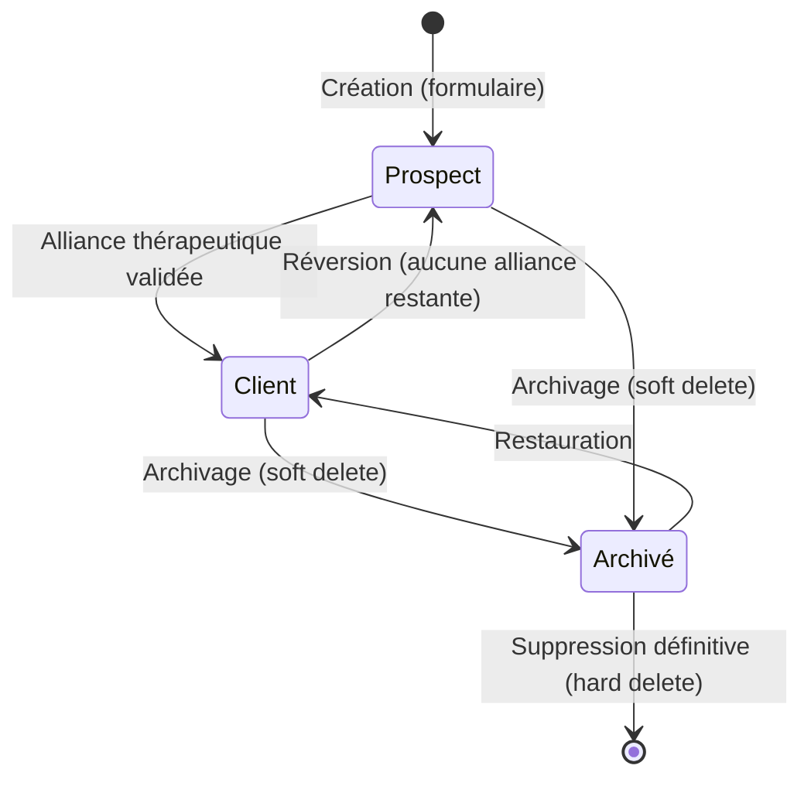
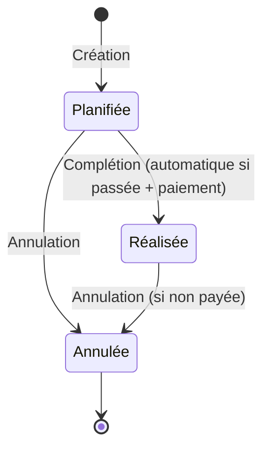
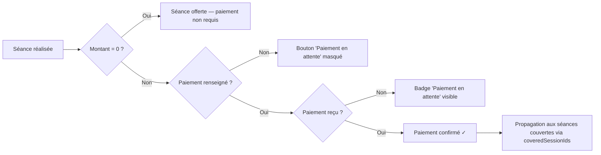
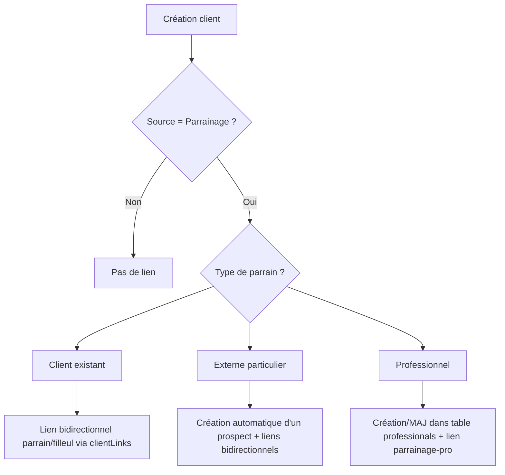
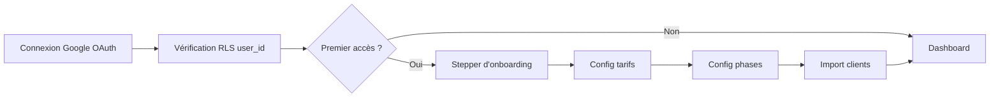

# Règles Métier — CoachCRM

## Cycle de vie du client

### Création
- Tout nouveau client est créé en tant que **prospect** (`phase: 'prospect'`)

### Transition Prospect → Client
- **Déclencheur** : une séance est complétée (`completed`) ET (un moyen de paiement est renseigné OU le montant est à zéro)
- Le client passe à la première phase thérapeutique (par défaut `debut`)

### Réversion Client → Prospect

#### 1. Par annulation de séance
- **Déclencheur** : une séance est annulée (`cancelled`)
- **Condition** : aucune autre séance du client ne valide l'alliance
- **Résultat** : le client redevient prospect

#### 2. Par suppression du moyen de paiement
- **Déclencheur** : le moyen de paiement d'une séance est supprimé (mis à null)
- **Condition** : aucune autre séance du client ne valide l'alliance
- **Résultat** : le client redevient prospect

#### 3. Par modification du montant (séance offerte → payante)
- **Déclencheur** : le montant d'une séance passe de 0 à > 0 (et aucun moyen de paiement n'est renseigné)
- **Condition** : aucune autre séance du client ne valide l'alliance
- **Résultat** : le client redevient prospect

> **Alliance thérapeutique** = au moins 1 séance `completed` + (`paymentMethod` renseigné OU `paymentAmount = 0`)

## Création de séance (modale Accueil)

### Champs obligatoires
- **Client** : sélection obligatoire parmi les clients actifs (prospects exclus)

### Valeurs par défaut
- **Date** : par défaut = date du jour
- **Heure** : par défaut = heure entière (XX:00) qui précède l'instant actuel
- **Note de préparation** : optionnel
- **Durée** : par défaut 60 minutes (modifiable dans le détail de la séance)

### Comportement UI
- Pas de ligne horizontale entre les sections de la modale
- Si aucun client ne correspond à la recherche : afficher « Aucun client trouvé »
- Si une séance existe déjà pour le même client + même jour : alerte doublon
- Si d'autres séances existent le même jour (autre client) : alerte informative

### Limite de planification
- **Maximum 6 mois dans le futur** : l'input date est limité via `max`, le bouton de création est désactivé, et un message d'erreur s'affiche si la date dépasse la limite
- Pas de restriction sur les dates passées (confirmation demandée)

### Barre d'action flottante (pour sélection multiple)
- **Contextes** : Utilisé pour les suppressions groupées (Archivage, Suppression Réseau Pro).
- **Format** : Bandeau collant en bas de tableau, fond blanc, texte d'état à gauche, bouton(s) d'action à droite.

## Composants Dashboard (Pilotage)

### Section "Action requise" (Dashboard)
- **Position** : Haut de la colonne de droite (34%).
- **Contenu** : Fusion des urgences techniques (CR, Paiements, Factures) et des relances clients.
- **Visuel** : Cartes verticales compactes avec icônes de couleur, transition au survol pour inciter à l'action.

### Grid de Pilotage
- **Structure** : Layout flexible `65fr 35fr` (Desktop).
- **Gauche (65%)** : Focus sur l'immédiat (Agenda, Préparation de séance).
- **Droite (35%)** : Focus sur la gestion proactive (Urgences, Relances, Stats).

### Navigation "Retour" intelligente
- **Règle** : Le bouton de retour sur une fiche client doit préserver le flux de travail de l'utilisateur.
- **Comportement** :
    - Si l'utilisateur accède à la fiche via le **tableau de bord** (clic sur un agenda ou une relance) : le bouton "Retour" renvoie à l'accueil (`/`).
    - Si l'utilisateur y accède via la **liste des clients** : le bouton "Retour" renvoie à `/couples` (avec maintien de l'onglet actif Prospect/Client).
    - Si l'accès est direct (URL) : fallback sur la liste des clients.

### Création de séance depuis la fiche client
- Le bouton « + Séance » crée la séance avec les valeurs par défaut (date = aujourd'hui, heure = heure courante, phase héritée) et **ouvre immédiatement le panneau SessionDetailModal** (le grand panneau avec phase, date, note, dictée, données comptables, facturation)
- L'utilisateur peut ensuite modifier la date, l'heure, la note de préparation et les données comptables
- La limite de 6 mois s'applique sur le champ date du SessionDetailModal

### Phase héritée
- La nouvelle séance hérite de la **phase de la dernière séance** du client (si elle existe)
- Sinon, hérite de la **phase du client** (sauf si prospect)
- **Première séance d'un prospect** → phase = première phase thérapeutique configurée (par défaut : `début`)

## Complétion automatique de séance

### Conditions (les 2 sont obligatoires)
1. **Date + durée ≤ maintenant** : la séance est dans le passé
2. **Condition de paiement** : un moyen de paiement est renseigné (`paymentMethod` ≠ null) **OU** le montant est à 0 (séance offerte)

### Déclenchement
- Au **chargement de l'application** (pour toutes les séances `scheduled` remplissant les 2 conditions)
- Lors d'une **mise à jour de séance** (ex: choix du moyen de paiement → complétion automatique)

### Ce qui ne déclenche PAS la complétion
- La rédaction d'un compte-rendu (CR)
- La modification de notes
- Tout update qui ne concerne pas le paiement

> ⚠️ **Règle absolue** : une séance passée **reste** en statut `scheduled` tant que la condition de paiement n'est pas remplie. Elle apparaît alors avec le badge « CONFIRMER » et le bouton « Rédiger CR ».

## Cycle de vie d'une Séance

## Signalétique des séances passées non confirmées

### Définition
Une séance est considérée « passée » dès que `date de la séance ≤ maintenant`, indépendamment de son `status` technique (`scheduled` ou `completed`).

### Conditions d'activation
- La séance est passée
- Le mode de paiement n'est **pas** renseigné (`paymentMethod` = null)
- Le montant effectif est **> 0** (exclut les séances offertes)
- Le statut n'est **pas** `cancelled`

### Éléments visuels obligatoires (les 3 ensemble)
1. **Badge « CONFIRMER »** — affiché dans la ligne d'info, couleur ambre `#D97706`
2. **Message d'alerte** — texte : *« Séance à confirmer — Veuillez renseigner le mode de paiement. »*, même couleur
3. **Bouton « Rédiger CR »** — affiché à droite de la carte, fond `#FFF3E0`, couleur `#E67E22`
4. **Icône ⚠️** — triangle d'avertissement en coin droit (pour les séances `scheduled` passées sans CR)

> ⚠️ **Règle absolue** : ces 3 éléments doivent **toujours** apparaître ensemble pour toute séance passée non confirmée. Il ne doit jamais y avoir de séance passée avec l'icône ⚠️ seule sans le badge et le message.

### Synchronisation inter-pages
Cette signalétique est **identique** sur toutes les vues grâce au composant partagé `src/components/session/SessionCard.jsx` :
- **Page d'accueil** (calendrier des séances) — `showClientName={true}`
- **Page client** (timeline thérapie) — `showClientName={false}, showExpandedStyle={true}`
- **Modale détail séance**
- **Suivi financier** (détail par séance)

> ⚠️ **Règle métier — Notes et Comptes rendus** :
> - Le champ `summary` (Résumé) est utilisé de manière polyvalente : **Note de préparation** pour les séances futures (`scheduled` et date > maintenant), **Compte rendu** pour les séances passées.
> - L'icône de document (`FileText`) ne s'affiche **que** pour les séances passées ayant un contenu. Elle est masquée pour les séances futures pour éviter toute confusion avec une note de préparation.
> - La note de préparation s'affiche toujours en texte à côté du badge de phase pour les séances planifiées. Le texte est **limité à 30 caractères** (via `slice(0, 30) + '…'`) pour garantir la lisibilité.

> ⚠️ **Règle absolue** : toute modification visuelle de carte de séance doit se faire exclusivement dans `SessionCard.jsx`. Il est strictement interdit de dupliquer le JSX de rendu dans les pages.

Toute modification de la signalétique doit être répercutée sur **toutes** ces vues simultanément.

## Annulation de séance
- **Interdit** si un moyen de paiement est renseigné ET montant > 0 → alerte utilisateur
- Avant d'annuler, l'utilisateur doit d'abord supprimer le moyen de paiement
- **Exception** : les séances offertes (montant = 0) peuvent toujours être annulées

### Suppression définitive de séance annulée
- L'icône **XCircle** sur les séances annulées est un **bouton cliquable** qui supprime définitivement la séance
- **Confirmation obligatoire** via le ConfirmDialog (variant `destructive`)
- La séance disparaît du **timeline** et du **calendrier** après suppression
- Fonctionne sur les **2 vues** : timeline client (CoupleDetailPage) et calendrier d'accueil (DashboardPage)
- Implémenté via `onDelete` dans `SessionCard.jsx` avec `stopPropagation` (ne déclenche pas l'ouverture du détail)

## Suppression groupée de séances (accueil)
- Disponible uniquement sur l'onglet **« En cours »** du calendrier d'accueil
- L'utilisateur active le **mode sélection** via le bouton « Sélectionner »
- En mode sélection : clic sur une carte = sélection/désélection (pas de navigation)
- Une **barre d'action flottante** affiche le nombre de séances sélectionnées
- Boutons : « Tout sélectionner / Tout désélectionner » + « Supprimer (N) »
- La suppression déclenche une **confirmation obligatoire** via le ConfirmDialog
- **Cascade** : les reports liés aux séances supprimées sont également supprimés
- **Vérification d'alliance** : après suppression, pour chaque client affecté, le système vérifie si des séances restantes valident l'alliance thérapeutique. Si aucune séance ne la valide, le client redevient automatiquement **prospect**
- Après suppression, le mode sélection se désactive automatiquement

## Relance prospects (Dashboard)
- **Cible** : Uniquement les dossiers en phase `prospect`.
- **Règle** : Un prospect est marqué « À relancer » s'il est actif, n'a aucune séance future prévue, et que sa dernière séance remonte à plus de 14 jours.
- **Nouveau prospect** : Un prospect créé sans aucune séance est également marqué à relancer après 14 jours d'inactivité.
- **Navigation** : Le bouton « Voir tous les prospects » du Dashboard redirige spécifiquement vers `/couples?tab=prospects&view=list` pour permettre un traitement de masse efficace.

## Flux de Paiement & Facturation

### Règle du Badge « FACTURE »
- **Condition** : Le badge s'affiche sur la carte séance si `needsInvoice` est à vrai (SessionCard).
- **États visuels** :
    - **À ENVOYER** : Couleur bleu foncé `#1A365D`, fond transparent.
    - **ENVOYÉE** : Couleur vert `var(--success)`, accompagné d'une coche `CheckCircle`.
- **Calcul** : Basé sur le champ `invoice_sent` de la séance.

## Bouton « Paiement en attente »
- **N'apparaît pas** tant que le mode de paiement n'a pas été choisi ET que le montant du paiement est > 0
- Conditions requises : `paymentMethod` renseigné + `paymentAmount > 0`

## Séance offerte (montant = 0)

### Affichage dans la carte séance
- Le badge en en-tête affiche **« Séance offerte »** en rouge
- L'alerte **« Séance à confirmer »** est **toujours masquée** (pas de paiement à confirmer pour cette séance)
- Le badge **« CONFIRMER »** est **toujours masqué**

### Mode de paiement (section comptable)
- **Si aucune autre séance payante n'est couverte** par ce paiement :
  - Les boutons (Espèces, Chèque, Virement) sont **remplacés** par le badge rouge « Séance offerte »
- **Si d'autres séances payantes sont couvertes** (`coveredSessionIds` contient des séances avec montant > 0) :
  - Les boutons de paiement restent **visibles** pour permettre la confirmation du paiement des séances couvertes
  - Le badge « Séance offerte » s'affiche en complément au-dessus des boutons
- **Champs masqués** : « Montant du paiement » et « Séances concernées par ce paiement » sont **cachés**

### Suivi financier
- « Séance offerte » remplace le mode de paiement

### Alliance thérapeutique (Statut Prospect ↔ Client)

L'alliance thérapeutique est validée par la présence d'au moins une séance « payée » ou « offerte ».

- **Condition de validation** : Une séance est considérée comme validant l'alliance si elle est au statut `completed` (terminée) **ET** qu'un mode de paiement est renseigné (ou si le montant = 0€).
- **Transition Prospect → Client** : Automatique dès que la **première séance** validant l'alliance est créée ou confirmée. Le client passe de la phase `prospect` à la première phase thérapeutique (ex: `début`).
- **Transition Client → Prospect** : Automatique si **toutes les séances** validant l'alliance sont supprimées ou annulées. Le client redevient un prospect.
- **Événements déclencheurs** : 
  - Création d'une séance passée avec paiement.
  - Mise à jour d'une séance (passage à `completed`, ajout d'un paiement).
  - Suppression d'une séance (individuelle ou groupée).
  - Annulation d'une séance.

> ⚠️ **Note technique — Calcul du montant effectif** :
> Le montant d'une séance est déterminé par `getRate()` dans `useSessionModalState.js`, avec la priorité suivante :
> 1. `rateOverrides[sessionId]` — modification en cours (volatile, mémoire uniquement)
> 2. `session.paymentAmount` — montant persisté en DB (même si = 0 pour séance offerte)
> 3. `originalRate` / `sessionRate` — tarif par défaut du client (fallback)
>
> **Règle absolue** : ne jamais utiliser `session.paymentAmount ?? rate` directement. Toujours passer par `getRate()` pour garantir la cohérence entre le montant affiché et les badges (« Séance offerte », « CONFIRMER »).

> ⚠️ **Comportement confirmé** :
> - Le compteur « Séances à confirmer » dans le suivi financier **inclut** les séances offertes
> - Le `paymentReceived` se propage aux séances couvertes via `coveredSessionIds` quand le paiement est confirmé

## Dédoublonnage
- Alerte si même client + même jour (bloquante avec confirmation)
- Alerte si autres clients le même jour (informationnelle, désactivée pour les prospects)

## Date de création du dossier
- **Modifiable** : clic sur la date dans la timeline de la thérapie → input date inline
- **Alerte visuelle** : un bandeau ambre discret (`#FFFBEB`, bordure `#FEF3C7`, icône `AlertTriangle` `#D97706`) s'affiche sous le champ :  
  *« Cette date impacte l'historique et les cycles de thérapie »*
- **Confirmation obligatoire** : ConfirmDialog variant `danger` avant persistance
- **Persistance** : `updateClient(id, { startDate })` → colonne `start_date` en DB

## Comptes rendus (CR en attente)
- L'indicateur « CR en attente » sur la fiche client compte les **séances complétées sans compte rendu** dans le cycle actif
- Formule : `activeCycleSessions.filter(s => s.status === 'completed' && !s.hasReport)`
- Couleur : `var(--warning)` si > 0, `var(--info)` sinon
- L'ancien compteur « CR » (nombre de CR remplis) est toujours disponible via `reportsCount` pour la synthèse IA

## Archivage et suppression
- **Archivage** (soft delete) : le client est masqué mais restaurable
- **Suppression définitive** (hard delete) : supprime le client + séances + CR + contacts (irréversible)
- Sélection multiple possible (checkboxes) dans les deux pages

## Champs numériques
- **Zéros en début de saisie** : interdit (ex: `007` → `7`, `00` → `0`)
- La valeur `0` reste autorisée (ex: séance offerte)
- Appliqué globalement via un listener sur tous les `input[type="number"]`

## Parrainage

### 3 niveaux de référencement
1. **Client → Client** (type `parrainage`, roles `parrain`/`filleul`) — liens bidirectionnels via `clientLinks[]`
2. **Externe particulier → Client** — crée un prospect automatiquement + liens bidirectionnels
3. **Professionnel externe → Client** (type `parrainage-pro`) — lien avec le réseau pro

### Validation à la création d'un client
- Si source = `parrainage` ou `referral`, le champ **« Orienté par »** est **obligatoire** (client existant OU externe avec nom renseigné)
- Le bouton « Créer le client » est **désactivé** tant que cette condition n'est pas remplie
- Le composant partagé **`ReferrerSection.jsx`** est utilisé à la création (CouplesPage) et à l'édition (EditIdentityModal) pour garantir un comportement identique

### Anti-doublons et intégrité
- **Détection de doublons parrains particuliers** : comparaison nom/prénom/email/phone avec les clients existants → alerte `DuplicateAlert` avec option « Lier »
- **Détection de doublons parrains professionnels** : comparaison nom/prénom avec la table `professionals` → alerte `DuplicateAlert` avec option « Lier »
- La détection s'applique partout : création ET édition (via `ReferrerSection`)
- Anti auto-parrainage : un client ne peut pas se parrainer lui-même
- Détection de boucle : A parrain de B ET B parrain de A → interdit
- Doublon de lien : un même lien ne peut pas être créé deux fois

### Nettoyage automatique
- Changement de source (≠ parrainage) → supprime tous les liens de parrainage + `externalReferrer`
- Suppression d'un lien filleul → suppression du lien inverse chez le parrain

### Persistance
- `clientLinks` persisté en DB via colonne `client_links` (JSONB)
- `externalReferrer` persisté en DB via colonne `external_referrer` (JSONB)

## Avatars
- **Client inactif** : initiales en **blanc** sur fond `primary-200`
- **Prospect** : initiales en `#6B46C1` sur fond `#E8D8FE`
- **Client actif** : initiales en blanc sur fond `accent-main`
- **Initiales** : calculées via `getCoupleInitials` avec fallback sur `?`

## Sécurisation et Stabilité

### 1. Robustesse des données (Anti-Crash)
- **Règle d'or** : Tout composant ou helper manipulant des données provenant de Supabase **DOIT** utiliser des gardes (`optional chaining ?.`) et des fallbacks.
- **Dates** : Interdiction d'appeler `.split('T')` ou `.startsWith()` sur un champ date sans vérifier sa présence : `session.date?.split('T')[0] || ''`.
- **Tri** : Les tris via `localeCompare` doivent toujours avoir des fallbacks de chaîne vide pour éviter les crashs sur des valeurs `null`.
- **SessionCard** : Ce composant étant central, il doit être ultra-résilient. Toutes les variables de calcul (`isPast`, `isPlanned`, `sessionPAmount`) sont isolées en début de composant avec des gardes strictes.

### 2. Authentification
- **Timeout de sécurité** : Un délai de **10 secondes** est configuré dans `App.jsx` pour permettre la synchronisation complète des données utilisateur (Goole Auth → Table `users`) avant de basculer sur l'interface principale.
- **Chargement initial** : Un spinner de chargement est maintenu tant que l'utilisateur n'est pas synchronisé.
### Réseau Professionnel
- **Gestion des fiches** : Un professionnel peut être contacté, modifié ou supprimé.
- **Sélection Multiple** : Permet la suppression en masse des contacts sélectionnés via un bandeau d'action rouge.

### Pilotage Intelligent (Tableau de Bord)
- **Consolidation** : Toutes les actions prioritaires sont regroupées dans le bloc "Action requise" à droite.
- **Règle de Relance Prospects** : Un prospect est marqué « À relancer » si les conditions suivantes sont réunies :
    1. **Statut** : Le dossier est `active` et sa phase est `prospect`.
    2. **Engagement** : Aucune séance future n'est planifiée (`upcomingSessions`).
    3. **Délai** : La dernière séance réalisée remonte à **plus de 14 jours**.
    4. **Nouveau dossier** : Un nouveau prospect sans aucune séance est également marqué à relancer après 14 jours d'inactivité.
- **Urgences Administratives** : Les séances terminées sans compte-rendu, les paiements en attente de confirmation (> 0€) et les factures non envoyées sont signalés comme actions prioritaires.
### Gestion des partenaires
- **Ajout** : Les nouveaux partenaires peuvent être créés via la modale de création ou automatiquement lors d'un parrainage professionnel (si inconnu).
- **Suppression** : 
    - **Individuelle** : Possible via l'icône corbeille (non destructive si liée à des parrainages, mais retire le partenaire de la liste active).
    - **Groupée** : Sélection multiple disponible en vue liste. La suppression groupée demande une confirmation unique via `ConfirmDialog`.
- **Intégrité** : La suppression d'un professionnel ne supprime pas l'historique des parrainages sur les fiches clients (le nom est conservé en snapshot), mais le lien vers la fiche pro est rompu.

### Affichage (Vue Liste)
- Utilisation obligatoire du **Tableau Standard** (en-tête bleu, lignes alternées/hover).
- **Sélection multiple** activable par checkboxes individuelles ou globale en en-tête.
- **Barre d'action flottante rouge** pour les actions de masse (Suppression).

## Gestion Administrative (Mode Admin)

### Accès et Rôles
- **Admin** : Accès complet aux outils d'administration via `/admin`.
- **Thérapeute** : Accès limité à ses propres clients et séances.
- Les pages `/admin`, `/admin/deleted-clients` et `/admin/reseau-pro` sont protégées par une vérification du rôle en base de données.

### Clients Archivés (Page /admin/deleted-clients)
- Liste tous les clients ayant un `deleted_at` non null.
- **Restauration** : Le bouton « Restaurer » remet `deleted_at` à null et réactive le dossier.
- **Suppression définitive** : Action irréversible effaçant toutes les données liées.
- **Sélection groupée** : Barre flottante avec bouton rouge « Supprimer définitivement » après confirmation `danger`.

## Flux d'Onboarding Thérapeute

## Navigation et Routes

| Page | Route | Description |
|------|-------|-------------|
| Dashboard | `/` | Pilotage intelligent, agenda, urgences |
| Mes Clients | `/couples` | Annuaire des dossiers (actifs/prospects) |
| Fiche Client | `/couples/:id` | Timeline thérapeutique et identité |
| Finances | `/finances` | Suivi CA, encaissements et factures |
| Réseau Pro | `/admin/reseau-pro` | Partenaires et orientations (Admin) |
| Clients archivés | `/admin/deleted-clients` | Corbeille et restauration (Admin) |
| Administration | `/admin` | Vue d'ensemble des inscrits (Admin) |
| Paramètres | `/settings` | Préférences personnelles du thérapeute |
| Aide | `/help` | Guide d'utilisation et aide |
