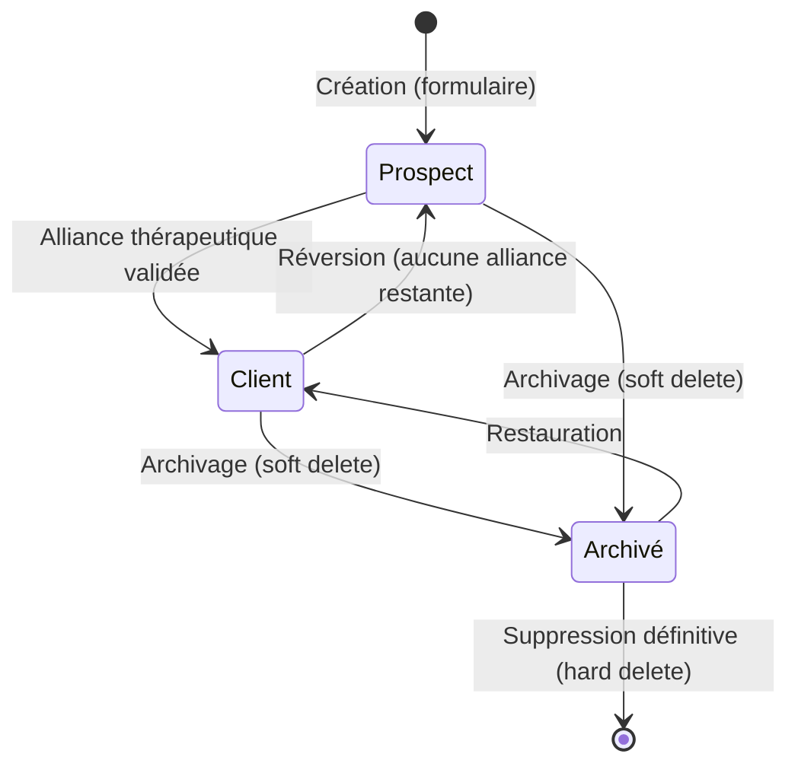
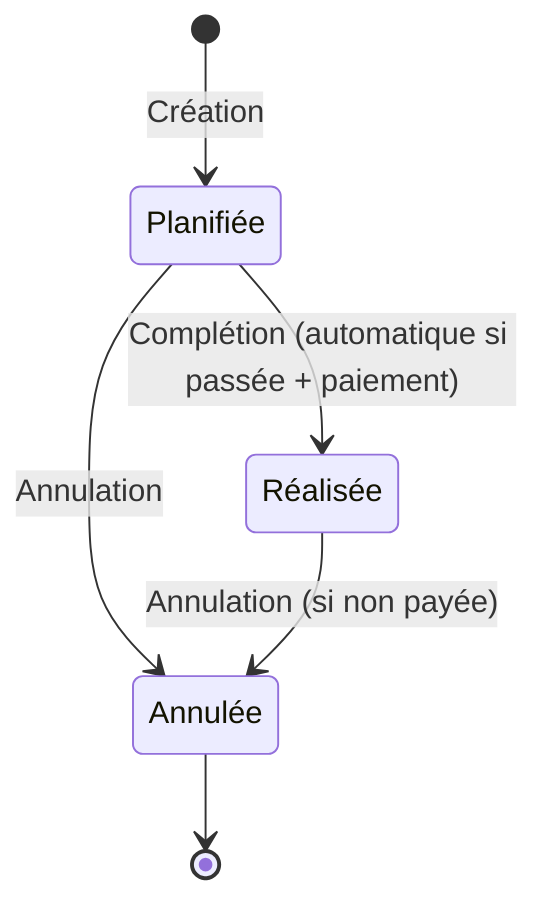
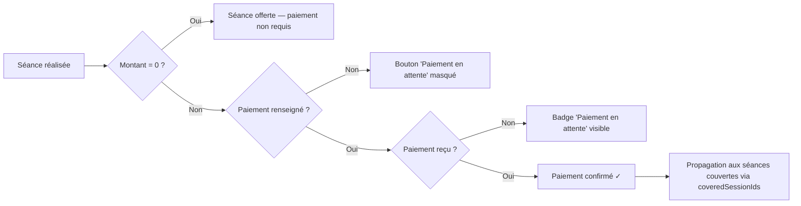
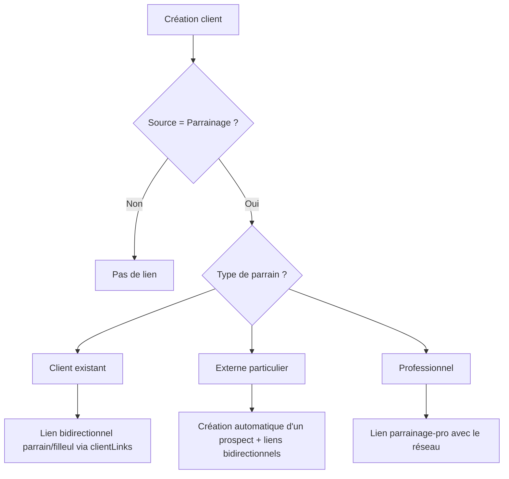
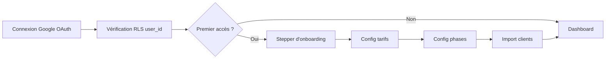

# Workflows — CoachCRM

> Ce document décrit les flux logiques (transitions d'état, enchaînements d'écrans) de l'application.
> Toute modification de statut ou de phase doit respecter ces flux.

---

## 1. Cycle de vie du Client

### Création
1. L'utilisateur clique sur « Nouveau client » (Dashboard ou page Clients)
2. Saisie de l'identité (partenaire A, optionnel B), type (couple/individuel/famille)
3. Sélection de la source de recrutement (obligatoire)
4. Si source = `Parrainage` → sélection obligatoire du parrain
5. Le client est créé en tant que **prospect** (`phase: 'prospect'`)

### Alliance thérapeutique (Prospect → Client)
**Déclencheur** : une séance est complétée (`completed`) **ET** (moyen de paiement renseigné **OU** montant = 0)
- La phase passe automatiquement de `prospect` à la première phase thérapeutique (par défaut `debut`)

### Réversion (Client → Prospect)
Se produit si **aucune séance restante** ne valide l'alliance. Trois scénarios possibles :
1. Annulation d'une séance
2. Suppression du moyen de paiement
3. Passage d'un montant de 0 à > 0 sans moyen de paiement

### Archivage & Suppression
- **Archivage** : soft delete (`deleted_at` renseigné), le client est masqué mais restaurable
- **Suppression définitive** : efface client + séances + CR + contacts (irréversible)

---

## 2. Cycle de vie d'une Séance

### Création
1. Depuis le Dashboard : bouton « Ajouter une séance »
2. Champs obligatoires : **Client** (actifs uniquement), **Date** (défaut: aujourd'hui), **Heure** (défaut: XX:00 précédente)
3. Note de préparation : optionnel
4. Vérifications : doublon même client + même jour, autres séances le même jour

### Complétion
- La séance est marquée `completed` quand elle est dans le passé ET qu'un moyen de paiement est renseigné ou que le montant est à 0
- Peut déclencher la transition Prospect → Client (alliance)

### Annulation
- **Interdit** si un moyen de paiement est renseigné ET montant > 0
- L'utilisateur doit d'abord supprimer le moyen de paiement
- **Exception** : les séances offertes (montant = 0) peuvent toujours être annulées
- Peut déclencher la réversion Client → Prospect

---

## 3. Flux de Paiement

### Modes de paiement
- Espèces, Chèque, Virement

### Facturation
1. L'utilisateur demande une facture (`needsInvoice = true`)
2. Sélection des séances couvertes (`invoiceCoveredSessionIds`)
3. Envoi de la facture (`invoiceSent = true`, `invoiceDate` renseigné)

---

## 4. Flux de Parrainage

### Validations
- Anti auto-parrainage : un client ne peut pas se parrainer lui-même
- Anti boucle : A parrain de B ET B parrain de A → interdit
- Anti doublon de lien

### Nettoyage
- Changement de source (≠ parrainage) → suppression de tous les liens + `externalReferrer`
- Suppression d'un lien filleul → suppression du lien inverse chez le parrain

---

## 5. Flux d'Onboarding Thérapeute

---

## 6. Navigation principale

| Page | Route | Description |
|------|-------|-------------|
| Dashboard | `/` | Vue d'ensemble, séances du jour, actions rapides |
| Clients | `/couples` | Liste des clients actifs + onglet prospects |
| Fiche client | `/couples/:id` | Détail complet d'un dossier |
| Finances | `/finances` | Suivi des paiements et factures |
| Réseau Pro | `/reseau` | Carnet d'adresses professionnel |
| Paramètres | `/settings` | Tarifs, phases, sources, profil |
| Bugs & Suggestions | `/bugs` | Feedback utilisateur |
| Visite guidée | `/visite` | Tour interactif de l'application |
